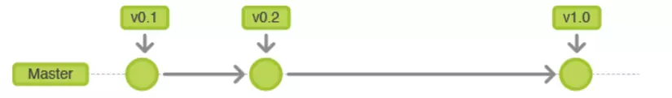
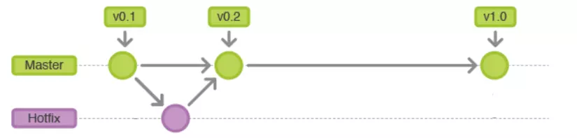
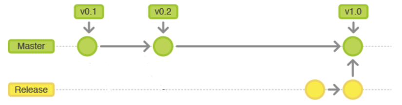
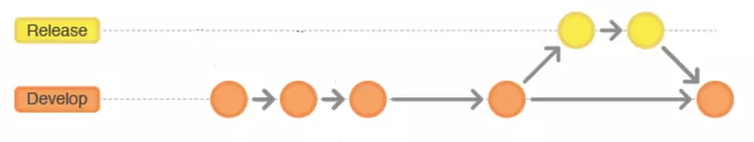
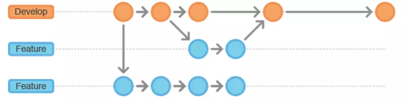

# **Report Basic C Programming**

## **Table of contents**
- [**Report Basic C Programming**](#report-basic-c-programming)
  - [**Table of contents**](#table-of-contents)
  - [**1. Compiling process and Cross-compiler**](#1-compiling-process-and-cross-compiler)
    - [**1.1. Compiling process**](#11-compiling-process)
      - [***1.1.1. Pre-processing step***](#111-pre-processing-step)
      - [***1.1.2. Compiling step***](#112-compiling-step)
      - [***1.1.3. Assembling step***](#113-assembling-step)
      - [***1.1.4. Linking step***](#114-linking-step)
    - [**1.2 Cross compiler**](#12-cross-compiler)
  - [**2. C libraries**](#2-c-libraries)
    - [**2.1. Static libraries**](#21-static-libraries)
    - [**2.2. Dynamic libraries**](#22-dynamic-libraries)
  - [**3. Makefile**](#3-makefile)
    - [**3.1. Rule**](#31-rule)
    - [**3.2. Variables**](#32-variables)
      - [**3.2.1. Definition**](#321-definition)
      - [**3.2.2. Flavors of variables**](#322-flavors-of-variables)
      - [**3.2.3. Some useful automatic variables**](#323-some-useful-automatic-variables)
    - [**3.3. Some useful functions**](#33-some-useful-functions)
  - [**4. Git**](#4-git)
    - [**4.1. Definition**](#41-definition)
    - [**4.2. Basic Git Commands**](#42-basic-git-commands)
    - [**4.3. Git workflow**](#43-git-workflow)


## **1. Compiling process and Cross-compiler**
### **1.1. Compiling process**
The compilation process in C involves 4 steps: pre-processing, compiling, assembling and linking.

#### ***1.1.1. Pre-processing step***

This step includes:
- Removal of comments.
- Expansion of macros.
- Expansion of the included files.
- Conditional compilation.

The pre-processing output is .i files.

**Example 1.1:**

>Header file:
>```C
>#ifndef MAIN_H
>#define MAIN_H
>
>void func_1();
>void func_2();
>
>#endif
>```
>
>Source file:
>```C
>/* Include main.h file */
>#include "main.h"
>
>/* Macro */
>#define PI          3.14
>#define SQUARE(a)   a*a
>
>/* main function */
>int main()
>{
>    float f = SQUARE(2)*PI;
>}
>```
>
>Typing below command in terminal to generate main.i file:
>```
>gcc -E main.c -o main.i
>```
>
>main.i file's content:
>```C
># 0 "main.c"
># 0 "<built-in>"
># 0 "<command-line>"
># 1 "/usr/include/stdc-predef.h" 1 3 4
># 0 "<command-line>" 2
># 1 "main.c"
>
># 1 "main.h" 1
>
>
>
>void func_1();
>void func_2();
># 3 "main.c" 2
>
>
>
>
>
>
>int main()
>{
>    float f = 2*2*3.14;
>}
>```

#### ***1.1.2. Compiling step***

This step is to compile .i files to .s file in assembly-level instruction.

**Example 1.2: Using main.c and main.h file in example 1**

>Typing below command to terminal to generate main.s file:
>```
>gcc -S main.c -o main.s
>```
>Content of main.s file:
>```as
>    .file	"main.c"
>    .text
>    .globl	main
>    .type	main, @function
>main:
>.LFB0:
>    .cfi_startproc
>    endbr64
>    pushq	%rbp
>    .cfi_def_cfa_offset 16
>    .cfi_offset 6, -16
>    movq	%rsp, %rbp
>    .cfi_def_cfa_register 6
>    movss	.LC0(%rip), %xmm0
>    movss	%xmm0, -4(%rbp)
>    movl	$0, %eax
>    popq	%rbp
>    .cfi_def_cfa 7, 8
>    ret
>    .cfi_endproc
>.LFE0:
>    .size	main, .-main
>    .section	.rodata
>    .align 4
>.LC0:
>    .long	1095300547
>    .ident	"GCC: (Ubuntu 11.3.0-1ubuntu1~22.04.1) 11.3.0"
>    .section	.note.GNU-stack,"",@progbits
>    .section	.note.gnu.property,"a"
>    .align 8
>    .long	1f - 0f
>    .long	4f - 1f
>    .long	5
>0:
>    .string	"GNU"
>1:
>    .align 8
>    .long	0xc0000002
>    .long	3f - 2f
>2:
>    .long	0x3
>3:
>    .align 8
>4:
>```

#### ***1.1.3. Assembling step***

This step is to compile .s files to .o files in machine-level instruction.

Number of .o files generated is number of .c files.

**Example 1.3: Using main.c and main.h file in example 1**

>Typing below command to terminal to generate main.s file:
>```
>gcc -c main.c -o main.o
>```
>Content of main.o file:
>```
>ELF\00\00\00\00\00\00\00\00\00\00>\00\00\00\00\00\00\00\00\00\00\00\00\00\00\00\00\00\00\00\00\00\00\00\00\00\00\00\00\00\00@\00\00\00\00\00@\00\00
>\00��UH���\00\00\00\00�E��\00\00\00\00]���HA\00GCC: (Ubuntu 11.3.0-1ubuntu1~22.04.1) 11.3.0\00\00\00\00\00\00\00\00\00\00\00\00GNU\00\00\00�\00\00\00\00\00\00\00\00\00\00\00\00\00\00\00\00\00zR\00x�\00\00\00\00\00\00\00\00\00\00\00\00\00\00\00\00E�C
>S\00\00\00\00\00\00\00\00\00\00\00\00\00\00\00\00\00\00\00\00\00\00\00\00\00\00\00\00\00\00\00��\00\00\00\00\00\00\00\00\00\00\00\00\00\00\00\00\00\00\00\00\00\00\00\00\00\00\00\00\00\00\00\00\00\00\00\00\00\00\00\00\00\00\00\00\00\00\00\00\00\00\00\00\00\00\00\00\00\00\00\00\00\00\00\00\00\00\00\00\00\00\00\00\00\00\00\00\00\00\00\00\00main.c\00main\00\00\00\00\00\00\00\00\00\00\00\00\00\00\00\00\00�������� \00\00\00\00\00\00\00\00\00\00\00\00\00\00\00\00\00\00\00\00\00\00.symtab\00.strtab\00.shstrtab\00.rela.text\00.data\00.bss\00.rodata\00.comment\00.note.GNU-stack\00.note.gnu.property\00.rela.eh_frame\00\00\00\00\00\00\00\00\00\00\00\00\00\00\00\00\00\00\00\00\00\00\00\00\00\00\00\00\00\00\00\00\00\00\00\00\00\00\00\00\00\00\00\00\00\00\00\00\00\00\00\00\00\00\00\00\00\00\00\00\00\00\00\00\00\00\00\00\00 \00\00\00\00\00\00\00\00\00\00\00\00\00\00\00\00\00\00\00\00\00@\00\00\00\00\00\00\00\00\00\00\00\00\00\00\00\00\00\00\00\00\00\00\00\00\00\00\00\00\00\00\00\00\00\00\00\00\00\00\00\00\00\00\00@\00\00\00\00\00\00\00\00\00\00\00\00\00\00\00p\00\00\00\00\00\00\00\00\00\00\00\00\00\00\00\00\00\00\00\00\00\00\00\00\00\00\00\00\00\00\00\00\00&\00\00\00\00\00\00\00\00\00\00\00\00\00\00\00\00\00\00\00\00\00\\00\00\00\00\00\00\00\00\00\00\00\00\00\00\00\00\00\00\00\00\00\00\00\00\00\00\00\00\00\00\00\00\00\00\00\00\00\00,\00\00\00\00\00\00\00\00\00\00\00\00\00\00\00\00\00\00\00\00\00\\00\00\00\00\00\00\00\00\00\00\00\00\00\00\00\00\00\00\00\00\00\00\00\00\00\00\00\00\00\00\00\00\00\00\00\00\00\001\00\00\00\00\00\00\00\00\00\00\00\00\00\00\00\00\00\00\00\00\00\\00\00\00\00\00\00\00\00\00\00\00\00\00\00\00\00\00\00\00\00\00\00\00\00\00\00\00\00\00\00\00\00\00\00\00\00\009\00\00\00\00\00\000\00\00\00\00\00\00\00\00\00\00\00\00\00\00\00`\00\00\00\00\00\00\00.\00\00\00\00\00\00\00\00\00\00\00\00\00\00\00\00\00\00\00\00\00\00\00\00\00\00\00\00\00B\00\00\00\00\00\00\00\00\00\00\00\00\00\00\00\00\00\00\00\00\00\00�\00\00\00\00\00\00\00\00\00\00\00\00\00\00\00\00\00\00\00\00\00\00\00\00\00\00\00\00\00\00\00\00\00\00\00\00\00\00R\00\00\00\00\00\00\00\00\00\00\00\00\00\00\00\00\00\00\00\00\00�\00\00\00\00\00\00\00 \00\00\00\00\00\00\00\00\00\00\00\00\00\00\00\00\00\00\00\00\00\00\00\00\00\00\00\00\00\00j\00\00\00\00\00\00\00\00\00\00\00\00\00\00\00\00\00\00\00\00\00�\00\00\00\00\00\00\008\00\00\00\00\00\00\00\00\00\00\00\00\00\00\00\00\00\00\00\00\00\00\00\00\00\00\00\00\00\00e\00\00\00\00\00\00@\00\00\00\00\00\00\00\00\00\00\00\00\00\00\00�\00\00\00\00\00\00\00\00\00\00\00\00\00\00\00\00	\00\00\00\00\00\00\00\00\00\00\00\00\00\00\00\00\00\00\00\00\00\00\00\00\00\00\00\00\00\00\00\00\00\00\00\00\00\00\00�\00\00\00\00\00\00\00x\00\00\00\00\00\00\00\00\00\00\00\00\00\00\00\00\00\00\00\00\00\00\00\00\00\00\00	\00\00\00\00\00\00\00\00\00\00\00\00\00\00\00\00\00\00\00\00\00\00`\00\00\00\00\00\00
>\00\00\00\00\00\00\00\00\00\00\00\00\00\00\00\00\00\00\00\00\00\00\00\00\00\00\00\00\00\00\00\00\00\00\00\00\00\00\00\00\00\00\00\00\00\00\00\00\00\00\00\00�\00\00\00\00\00\00t\00\00\00\00\00\00\00\00\00\00\00\00\00\00\00\00\00\00\00\00\00\00\00\00\00\00\00\00\00\00
>```

#### ***1.1.4. Linking step***

This step is to link all .o files and static library files to generate executable file.

### **1.2 Cross compiler**

A cross compiler is a compiler capable of creating executable code for a platform other than the one on which the compiler is running.

Cross compiler has 5 phases:

- Lexical Analysis.
- Syntactic Analysis.
- Intermediate Code Generating.
- Optimization.
- Code Generation.

## **2. C libraries**
### **2.1. Static libraries**

A static library is  a set of object files that were copied into a single file. It can be linked with other object files in linking process to generate executable file.

The static library files must be named with prefix 'lib' and suffix '.a'.

To create the static library, use below command:
```
ar -rcs liblib_name.a obj_file_name.o
```
>with:
>- The 'r' flag tells ar to to insert object files or replaces object files in library, with the new object file.
>- The 'c' flag tells ar to create library if it doesn't already exist.
>- The 's' flag tells ar to index the library to speed up symbol look up inside it. 

To link static libraries into executable file, use below command:
```
gcc src_file_name.c -L. -llib_name -o exe_file_name
```
>with:
>- The 'L' flag specifies the path to libraries.
>- The 'l' flag specifies the libraries's name without prefix 'lib' and subfix '.a'.

### **2.2. Dynamic libraries**

A dynamic library is a collection of object files grouped into 1 file. It is not loaded into executable file, it is loaded into memory in running time and can be used by several running programs.

The shared library files must be named with prefix 'lib' and suffix '.so'.

To create the static library, use below command:
```
gcc -c -fPIC src_file_name.c -o obj_file_name.o
gcc -shared obj_file_name.o -o liblib_name.so
```
>with:
>- The 'fPIC' flag stands for 'Position Independent Code' generation, to make the code contained in the .o file is then valid whatever the virtual address occupied at runtime.
>- The 'shared' flag is used to generate shared library.

To link static libraries into executable file, use below command:

    gcc src_file_name.c -L. -llib_name -o exe_file_name

Add the absolute path to .so file to LD_LIBRARY_PATH to make shared library can run.

    export LD_LIBRARY_PATH = absolute_path


## **3. Makefile**
### **3.1. Rule**

A Makefile is a file name Makefile or makefile, that include a set of rules. A rule's structure looks like:


>with:
>- The targets are file names, separated by spaces. Typically, there is only one per rule.
>- The actions are a series of steps typically used to make the target(s). These need to start with a tab character, not spaces.
>- The dependencies are also file names, separated by spaces. These files need to exist before the commands for the target are run. If the dependencies file do not exist, the rules that has same target's name will run.

To run a rule, type in terminal the following command:
```
make target_name
```

**Example 3.1: Rule has dependency is a file**
> Suppose that there is a makefile with content:
>```make
>all: main.o
>   echo Hello makefile!!!
>```
>If there is no main.o file, the result when running `make` is:
>```
>make: *** No rule to make target 'main.o', needed by 'all'.  Stop.
>```
>if the file main.o is already exist, result is:
>```
>echo Hello makefile!!!
>Hello makefile!!!
>```

**Example 3.2: Rule has dependency is a rule's target**
>Suppose that there is a main.c file with content:
>```C
>#include <stdio.h>
>
>int main()
>{
>   printf("Running main.c\n");
>}
>```
>And a makefile with content:
>```make
>all: main.o
>   echo Hello makefile!!!
>
>main.o: main.c
>   echo Generate main.o file
>   gcc -c main.c -o main.o
>```
>if the file main.c is already exist, result is:
>```
>echo Generate main.o file
>Generate main.o file
>gcc -c main.c -o main.o
>echo Hello makefile!!!
>Hello makefile!!!
>```

### **3.2. Variables**
#### **3.2.1. Definition**
A variable is a name defined in a makefile to represent a string of text, called the variable's value.

To define a value for variables, use `:=` or `=`.

**Example 3.3: Define variable**
>```
>a = one two     # Store the string "one two" to a
>b = 'one two'   # Store the string "one two" to b
>c := "one two"  # Store the string "one two" to c
>```
>- Quotes have no meaning to makefile, it just need when using `printf` function

To refer to a variable, use `$(var_name)` or `${var_name}`.

**Example 3.4: Refer to variable**
>```make
>a = one two     # Store the string "one two" to a
>b = 'one two'   # Store the string "one two" to b
>c := "one two"  # Store the string "one two" to c
>all:
>    echo $(a)
>    echo ${b}
>    echo $(c)
>```
>Result when running `make` is:
>```
>one two    
>one two
>one two
>```

#### **3.2.2. Flavors of variables**
Flavors of variables is the ways that variables get value.

There are 2 flavors of variables:
- Recursive (use `=`): only looks for the variables when the command is *used*, not when it's *defined*.
- Simply expanded (use `:=`): Like normal imperative programming, only those defined so far get expanded.

**Example 3.5: Flavors of variables**
>```make
>a := one
>b = $(a)
>c := $(a)
>a += two
>all:
>    @echo $(a)
>    @echo $(b)
>    @echo $(c)
>```
>Result when running `make all` is:
>```
>one two    
>one two
>one
>```

#### **3.2.3. Some useful automatic variables**

`$@`: The target name of the rule.

`$^`: All dependencies of the rule.

`$<`: The first dependency of the rules.

`$?`: All dependencies that are changed and saved after the target.

`$%`: The target member name, when the target is an achieve member.

### **3.3. Some useful functions**

- **"wildcard" function**
    - **Syntax:**
        ```make
        $(wildcard pattern...)
        ```
    - **Function:** To get all object in folder.

    - **Example 3.6: Get all .c files in folder**
        ```make
        SRC = $(wildcard src/*/c)
        ```

- **"subst" function**
    - **Syntax:**
        ```make
        $(subst from, to, text)
        ```

    - **Function:** To replace a substring with another substring.

    - **Example 3.7: Change '.c' into '.o'**
        ```make
        SRC = main.c
        OBJ = $(subst '.c', '.o', $(SRC))
        ```

- **"patsubst" function**
    - **Syntax:**
        ```make
        $(patsubst pattern, replacement, text)
        ```

    - **Function:** Finds whitespace-separated words in text that match pattern and replaces them with replacement. Here pattern may contain a ‘%’ which acts as a wildcard, matching any number of any characters within a word. If replacement also contains a ‘%’, the ‘%’ is replaced by the text that matched the ‘%’ in pattern. Only the first ‘%’ in the pattern and replacement is treated this way; any subsequent ‘%’ is unchanged.

    - **Example 3.8: Change src/XXX.c to obj/XXX.o**
        ```make
        SRC = src/main.c src/func_1.c src/func_2.c
        OBJ = $(patsubst src/%.c, obj/%.o, $(SRC))
        ```

- **"foreach" function**
    - **Syntax:**
        ```make
        $(foreach var, list, text)
        ```

    - **Function:** To converts one list of words (separated by spaces) to another. *var* is set to each word in *list*, and *text* is expanded for each word.

    - **Example 3.9: Change "who are you" into "who! are! you!"**
        ```make
        foo := who are you
        bar := $(foreach wrd,$(foo),$(wrd)!)
        ```

## **4. Git**
### **4.1. Definition**
Git is a free and open source distributed version control system designed to handle everything from small to very large projects with speed and efficiency.

Git has 2 main areas, there are local area and remote area. Local area is a device that you working with your project. Remote area is a server that store your project data.

Local area consist of 3 sections: the working directory, the staging area, repository.


- **Working area**
    
    The working tree is a single checkout of one version of the project. These files are pulled out of the compressed database in the repository and placed on disk for you to use or modify.

- **Staging area**

    The staging area (the cache area or index) contains the working tree directory, including the repository, commits, and branches that would be committed.

- **Local repository**

    Local repository is where Git stores the metadata and object database for your project. This is the most important part of Git, and it is what is copied when you clone a repository from another computer.

- **Remote repository**

    Remote repository is a copy of local repository that is stored in server and can share with other people.

### **4.2. Basic Git Commands**

- **git init**
    - **Syntax:**
        
        ```make
        git init
        ```
    - **Function:** Initialization if git project.

- **git add**
    - **Syntax:**
        ```make
        # Add 1 file
        git add <file_name>
        # Add any thing
        git add .
        ```
    - **Function:** Add file(s) with changed content from *working direction* to *staging area*

- **git commit**
    - **Syntax:**
        
        ```make
        git commit -m "<commit_message>"
        ```
    - **Function:** Create a new commit containing the current contents of the staging area and the given log message describing the changes which is <commit_massage> given in command.

- git push
    - **Syntax:**

        ```make
        # Push a branch to remote repository
        git push <remote_name> <branch_name>
        # Push all branches to remote repository
        git push <remote_name> --all
        ```
    - **Function:** Push branch(es) in local repository to remote repository. 

- git pull
    - **Syntax:**
        
        ```make
        git pull
        ```
    - **Function:** Update local repository with remote repository.

- git branch
    - **Syntax:**
        ```make
        # Show all current branches
        # Can use -r flag to show all remote branches
        git branch
        # Create a branch
        git branch <branch_name>
        # Delete branch
        git branch -D <branch_name>
        ```

- git checkout
    - **Syntax:**
        
        ```make
        # Checkout <branch_name> branch
        git checkout <branch_name>
        # Create and checkout <branch_name> branch if it is not exist
        git checkout -b <branch_name>
        ```
    - **Function:** Initialization if git project.

- git merge
    - **Syntax:**
        
        ```make
        git merge <branch_name>
        ```
    - **Function:** Merge <branche_name> branch into current branch.

- git log
    - **Syntax:**
        
        ```make
        git log
        ```
    - **Function:** Show all commits, can use `--oneline` flag to show in short type.

- git status
    - **Syntax:**
        
        ```make
        git status
        ```
    - **Function:** Show which files are different from the last commit.

- git stash
    - **Syntax:**
        
        ```make
        # To save the change to the stack when we need to checkout another branch.
        git stash
        # To show the saved time list.
        # Can use -p flag to show content.
        git stash list
        # To restore.
        # x is a index of save time.
        git stash apply stash@{x}
        # To clean the stack.
        git stash drop stash@{x}
        #or
        git stash clear
        ```
### **4.3. Git workflow**
A Git workflow is a recipe or recommendation for how to use Git to accomplish work in a consistent and productive manner.


A git workflow usually consists of 5 kind of branches:

1. Master: Contain release versions for users, each release versions should have a tag.



2. Hotfix: Can be used for hot fixing release versions's errors on the master branch.



3. Release: To store the versions that are checked errors the last time before release.



4. Develop: When developers finish developing a feature of project in release branch, it will be merged into develop branch.



5. Feature: There can be a lot of feature branches in the same time, each feature branch is used to develop a feature of project.


