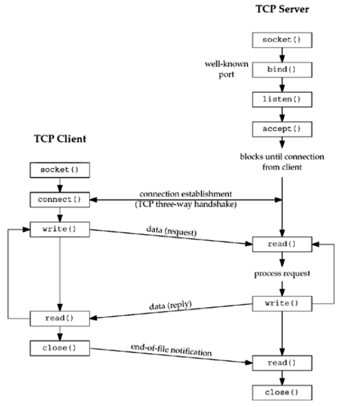
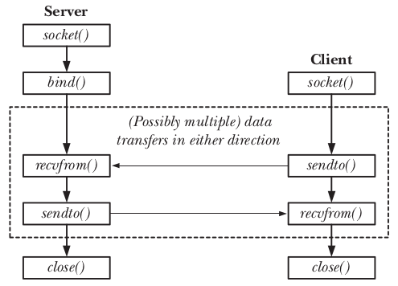
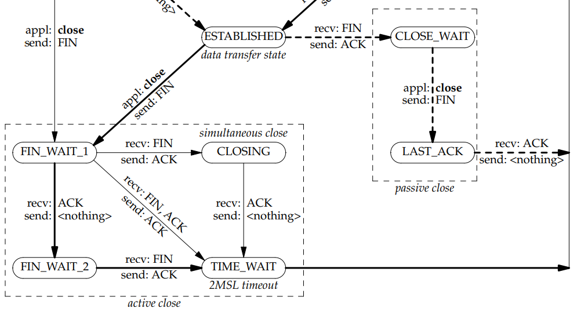

# **Report Linux Programming**
## **1. Sockets**
### **1.1. Overview**
Sockets are a method of iter-process communication (IPC) that allow data to be exchanged between applications, either on the same host (computer) or on different hosts connected by a network.

In a typical client-server scenario, applications communicate using sockets as follows:
- Each application creates a socket. A socket is the “apparatus” that allows communication, and both applications require one.
- The server binds its socket to a well-known address (name) so that clients can locate it.

A socket is created using the socket() system call, which returns a file descriptor used to refer to the socket in subsequent system calls:
```c
fd = socket(domain, type, protocol);
```

**Communication domains:**

Sockets exist in a communication domain, which determines:
- The method of identifying a socket (i.e., the format of a socket “address”).
- The range of communication (i.e., either between applications on the same host or between applications on different hosts connected via a network).

Modern operating systems support at least the following domains:
- The *UNIX* (AF_UNIX) domain allows communication between applications on the same host. (POSIX.1g used the name AF_LOCAL as a synonym for AF_UNIX, but
this name is not used in SUSv3.)
- The *IPv4* (AF_INET) domain allows communication between applications running on hosts connected via an Internet Protocol version 4 (IPv4) network.
- The *IPv6* (AF_INET6) domain allows communication between applications running on hosts connected via an Internet Protocol version 6 (IPv6) network. Although IPv6 is designed as the successor to IPv4, the latter protocol is currently still the most widely used.

|Domain  |Communication performed    |Communication between applications |Address format |Address structure  |
|:---------:|:---------:|:---------:|:---------:|:---------:|
|AF_UNIX    |within kernel  |on same host   |pathname   |sockaddr_un    |
|AF_INET    |via IPv4       |on hosts connected via IPv4 network    |32-bit IPv4 address and 16-bit port number |sockaddr_in    |
|AF_INET6   |via IPv6       |on hosts connected via IPv6 network    |128-bit IPv6 address and 16-bit port number |sockaddr_in6  |

**Socket types:**

Every sockets implementation provides at least two types of sockets: *stream* (SOCK_STREAM) and *datagram* (SOCK_DGRAM).

|Properties |Stream socket type    |Datagram socket type|
|:---------:|:---------:|:---------:|
|Realiable delivery         |Yes|No|
|Message boundaries reserved|No |Yes|
|Connection-oriented        |Yes|No|

**Socket protocol:**

The protocol parameter specifies a particular protocol to be used with the socket. In most cases, a single protocol exists to support a particular type of socket in a particular addressing family. If the protocol parameter is set to 0, the system selects the default protocol number for the domain and socket type requested. The default protocol for stream sockets is TCP. The default protocol for datagram sockets is UDP.

### **1.2. Socket address structures**
- **The sockaddr structure:**

    We see that each socket domain uses a different address format, a different structure type is defined to store a socket address. However, because system calls such as bind() are generic to all socket domains, they must be able to accept address structures of any type. In order to permit this, the sockets API defines a generic address structure, struct sockaddr. The only purpose for this type is to cast the various domain-specific address structures to a single type for use as arguments in the socket system calls.
    ```c
    /* POSIX.1g specifies this type name for the `sa_family' member.  */
    typedef unsigned short int sa_family_t;     /* sizeof(sa_family) = 2 */

    /* Structure describing a generic socket address.  */
    struct sockaddr
    {
        sa_family_t sa_family;	    /* Common data: address family and length. */
        char sa_data[14];		    /* Address data.  */
    };
    ```

- **The Internet Protocol (IPv4) address structure:**
    ```c
    /* POSIX.1g specifies this type name for the `sa_family' member.  */
    typedef unsigned short int sa_family_t;     /* sizeof(sa_family) = 2 */

    /* Type to represent a port.  */
    typedef uint16_t in_port_t;

    /* Internet address.  */
    typedef uint32_t in_addr_t;
    struct in_addr
    {
        in_addr_t s_addr;
    };

    struct sockaddr_in
    {
        sa_family_t sin_family;         /* Address family (AF_*) */
        in_port_t sin_port;			    /* Port number.  */
        struct in_addr sin_addr;		/* Internet address.  */

        /* Pad to size of `struct sockaddr'.  */
        unsigned char sin_zero[sizeof (struct sockaddr)
                    - __SOCKADDR_COMMON_SIZE
                    - sizeof (in_port_t)
                    - sizeof (struct in_addr)];
    };
    ```

- **The Internet Protocol (IPv6) address structure:**
    ```c
    /* IPv6 address */
    struct in6_addr
    {
        union
        {
            uint8_t	__u6_addr8[16];
            uint16_t __u6_addr16[8];
            uint32_t __u6_addr32[4];
        } __in6_u;
    #define s6_addr			__in6_u.__u6_addr8
    #ifdef __USE_MISC
    #   define s6_addr16		__in6_u.__u6_addr16
    #   define s6_addr32		__in6_u.__u6_addr32
    #endif
    };

    struct sockaddr_in6
    {
        sa_family_t sin6_family;        /* Address family */
        in_port_t sin6_port;            /* Transport layer port # */
        uint32_t sin6_flowinfo;	        /* IPv6 flow information */
        struct in6_addr sin6_addr;	    /* IPv6 address */
        uint32_t sin6_scope_id;	        /* IPv6 scope-id */
    };
    ```

**1.3. Address converting functions**

- **inet_aton() function:**

    The inet_aton() function converts the Internet host address *__cp* from the IPv4 numbers-and-dots notation into binary form in network byte order and stores it in the structure that *__inp* points to.
    ```c
    #include <arpa/inet.h>

    extern int inet_aton (const char *__cp, struct in_addr *__inp)
    ```
- **inet_ntoa() function:**
    
    The inet_ntoa() function returns a pointer to a string expressed in the dotted-decimal notation. inet_ntoa() accepts an Internet address expressed as a 32-bit quantity in network byte order and returns a string expressed in dotted-decimal notation.
    ```c
    #include <arpa/inet.h>

    extern char *inet_ntoa (struct in_addr __in)
    ```

- **inet_addr() function:**

    The inet_addr() function interprets character strings representing host addresses expressed in standard dotted-decimal notation and returns host addresses suitable for use as an Internet address.
    ```c
    #include <arpa/inet.h>

    extern in_addr_t inet_addr (const char *__cp)
    ```

- **inet_ntop() function:**

    The inet_ntop() function converts from an Internet address in binary format, specified by *__cp*, to standard text format, and places the result in *__buf*, when *__len*, the space available in *__buf*, is sufficient. The argument *__af* specifies the family of the Internet address. This can be AF_INET or AF_INET6.
    ```c
    #include <arpa/inet.h>

    extern const char *inet_ntop (int __af, const void *__restrict __cp,
			      char *__restrict __buf, socklen_t __len)
    ```

- **inet_pton() function:**

    The inet_pton() function converts an Internet address in its standard text format into its numeric binary form. The argument *__af* specifies the family of the address.
    ```c
    #include <arpa/inet.h>

    extern int inet_pton (int __af, const char *__restrict __cp,
		      void *__restrict __buf)
    ```

### **1.4. TCP socket**

TCP socket is a connection-oriented socket that uses the Transmission Control Protocol (TCP).

It requires 3-way handshake to set up connection.

The TCP socket guarantees that all data is received and acknowledged.



- **bind() system call:**

    The bind() system call is used by server to bind a socket to an address.

    ```c
    #include <sys/socket.h>

    int bind(int sockfd, const struct sockaddr *addr, socklen_t addrlen);
    ```

- **listen() system call:**

    The listen() system call marks the stream socket referred to by the file descriptor *sockfd* as passive. The socket will subsequently be used to accept connections from other (active) sockets.

    *backlog* argument is the number of pending connection requests from client before the server calls accept().

    ```c
    #include <sys/socket.h>

    int listen(int sockfd, int backlog);
    ```

- **accept() system call:**

    The accept() system call accepts an incoming connection on the listening stream socket referred to by the file descriptor *sockfd*. If there are no pending connections when accept() is called, the call blocks until a connection request arrives.

    ```c
    #include <sys/socket.h>
    
    int accept(int sockfd, struct sockaddr *addr, socklen_t *addrlen);
    ```

- **connect() system call:**

    The connect() system call connects the active socket referred to by the file descriptor *sockfd* to the listening socket whose address is specified by addr and addrlen.

    ```c
    #include <sys/socket.h>

    int connect(int sockfd, const struct sockaddr *addr, socklen_t addrlen);
    ```

### **1.5. UDP socket**

UDP socket is a connectionless socket that uses the User Datagram Protocol (UDP).

It has no handshaking dialogues and thus exposes the user's program to any unreliability of the underlying network; there is no guarantee of delivery, ordering, or duplicate protection.



- **recvfrom() system call:**

    ```c
    #include <sys/socket.h>

    ssize_t recvfrom(int sockfd, void *buffer, size_t length, int flags,
                struct sockaddr *src_addr, socklen_t *addrlen);

    /* Returns number of bytes received, 0 on EOF, or –1 on error */
    ```
    
    The bits that may be ORed in *flags* include the following:

    - **MSG_DONTWAIT**

        Perform a nonblocking recv(). If no data is available, then instead of blocking, return immediately with the error EAGAIN. We can obtain the same behavior by using fcntl() to set nonblocking mode (O_NONBLOCK) on the socket, with the difference that MSG_DONTWAIT allows us to control nonblocking behavior on a per-call basis.

    - **MSG_OOB**

        Receive out-of-band data on the socket.

    - **MSG_PEEK**

        Retrieve a copy of the requested bytes from the socket buffer, but don’t actually remove them from the buffer. The data can later be reread by another recv() or read() call.

    - **MSG_WAITALL**

        Normally, a recv() call returns the lesser of the number of bytes requested (length) and the number of bytes actually available in the socket. Specifying the MSG_WAITALL flag causes the system call to block until length bytes have
        been received. However, even when this flag is specified, the call may return fewer bytes than requested if: (a) a signal is caught; (b) the peer on a stream socket terminated the connection; (c) an out-of-band data byte
        was encountered; (d) the received message from a datagram socket is less than length bytes; or (e) an error occurs on the socket.

- **sendto() system call:**

    ```c
    ssize_t sendto(int sockfd, const void *buffer, size_t length, int flags,
                const struct sockaddr *dest_addr, socklen_t addrlen);

    /* Returns number of bytes sent, or –1 on error */
    ```

    the bits that may be ORed in *flags* include the following:
    - **MSG_DONTWAIT**

        Perform a nonblocking send(). If the data can’t be immediately transferred (because the socket send buffer is full), then, instead of blocking, fail with the error EAGAIN. As with recv(), the same effect can be achieved by setting the O_NONBLOCK flag for the socket.

    - **MSG_MORE** (since Linux 2.4.4)

        This flag is used with TCP sockets to achieve the same effect as the TCP_CORK socket option, with the difference that it provides corking of data on a per-call basis. Since Linux 2.6, this flag can also be used with datagram sockets, where it has a different meaning. Data transmitted in successive send() or sendto() calls specifying MSG_MORE is packaged into a single datagram that is transmitted only when a further call is made that does not specify this flag. (Linux also provides an analogous UDP_CORK socket option that causes data from successive send() or sendto() calls to be accumulated into a single datagram that is transmitted when UDP_CORK is disabled.) The MSG_MORE flag has no effect for UNIX domain sockets.

    - **MSG_NOSIGNAL**

        When sending data on a connected stream socket, don’t generate a SIGPIPE signal if the other end of the connection has been closed. Instead, the send() call fails with the error EPIPE. This is the same behavior as can be obtained by ignoring the SIGPIPE signal, with the difference that the MSG_NOSIGNAL flag controls the behavior on a per-call basis.

    - **MSG_OOB**

        Send out-of-band data on a stream socket.

- **connect() system call:**

    connect() system call can be used with USP socket. The term connected datagram socket is applied to such a socket.

    After a datagram socket has been connected:

    - Datagrams can be sent through the socket using write() (or send()) and are automatically sent to the same peer socket. As with sendto(), each write() call results in a separate datagram.

    - Only datagrams sent by the peer socket may be read on the socket.

### **1.6. Port number**

- ***Well-known ports*** (0-1023) are permanently assigned to specific applications.
    
    The range of well-known ports is 0 to 1023.

    Ex: the ssh daemon uses the well-known port 22; HTTP uses the well-known port 80.

- ***Registered ports*** are which are allocated to application developers on a less stringent basis.

    Not all port numbers in this range are registered.

    The range of registered ports is 1024 to 41951.

- ***Privileged ports:*** most TCP/IP implementations (including Linux), the port numbers in the range 0 to 1023 are also privileged, meaning that only privileged (CAP_NET_BIND_SERVICE) processes may bind to these ports.

- ***Ephemeral ports:***

    If an application doesn’t select a particular port, then TCP and UDP assign a unique ephemeral port number to the socket. In this case, the application doesn’t care which port number it uses, but assigning a port is necessary so that the transport-layer protocols can identify the communication endpoints. It also has the result that the peer application at the other end of the communication channel knows how to communicate with this application. TCP and UDP also assign an ephemeral port number if we bind a socket to port 0. 
    
    The range of Ephemeral ports is 49152 to 65535 as dynamic or private, with the intention that these ports can be used by local applications and assigned as ephemeral ports. However, various implementations allocate ephemeral ports from different ranges. On Linux, the range is defined by (and can be modified via) two numbers contained in the file /proc/sys/net/ipv4/ip_local_port_range.

### **1.7. "Address already in use" error**



- If the server is the active close, it will stuck in TIME_WAIT state and its port number can not be used for another socket in 2MSL (maximum segment lifetime) (60s).

- To know how long is 2MSL, use below command:
    ```
    cat /proc/sys/net/ipv4/tcp_fin_timeout
    ```

- To solve this error, use SO_REUSEADDR option by calling setsockopt() function before calling bind().

## **2. Process and thread**

## **3. Interprocess Communication (IPC)**

Therefore, Linux, like all modern UNIX implementations, provides a rich set of mechanisms for *interprocess communication* (IPC), including the following:

- **Signals**: which are used to indicate that an event has occurred;
pipes (familiar to shell users as the | operator) and FIFOs, which can be used to transfer data between processes.

- **Sockets**: which can be used to transfer data from one process to another, either on the same host computer or on different hosts connected by a network.

- **File locking**: which allows a process to lock regions of a file in order to prevent other processes from reading or updating the file contents.

- **Message queues**: which are used to exchange messages (packets of data) between processes;

- **Semaphores**: which are used to synchronize the actions of processes; and shared memory, which allows two or more processes to share a piece of memory. When one process changes the contents of the shared memory, all of the other processes can immediately see the changes.

### **3.1. Signal**


